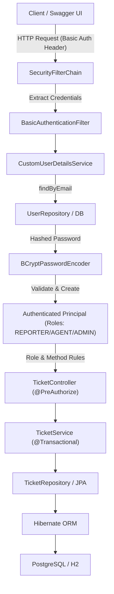

# ResolveHub

[](https://www.oracle.com/java/)
[](https://spring.io/projects/spring-boot)
[](https://spring.io/projects/spring-security)
[](https://maven.apache.org/)
[](https://www.postgresql.org/)
[](https://hibernate.org/)
[](http://localhost:8081/swagger-ui.html)
[](src/test/java)

**ResolveHub** is an enterprise-grade issue-tracking and resolution platform built with **Java 21, Spring Boot, Spring Security, Spring MVC, Spring Data JPA, Hibernate, and PostgreSQL**.

The system models a real-world ticket management workflow where users authenticate via **HTTP Basic Auth**, are authorized using strict **Role-Based Access Control (RBAC)** (`REPORTER`, `AGENT`, `ADMIN`), and can create, assign, update, filter, comment on, and audit issues across projects with transaction-safe state machines and centralized error handling.

---

## Table of Contents
- [Features](#features)
- [Architecture & Security Flow](#architecture--security-flow)
- [Security & Authentication Model](#security--authentication-model)
- [Domain Model](#domain-model)
- [OpenAPI & Swagger UI](#openapi--swagger-ui)
- [REST API Endpoints & Permissions](#rest-api-endpoints--permissions)
- [Dynamic Filtering & Search](#dynamic-filtering--search)
- [Audit Activities & Comments](#audit-activities--comments)
- [Global Exception Handling](#global-exception-handling)
- [Environment Configuration & Profiles](#environment-configuration--profiles)
- [Automated Testing](#automated-testing)
- [Getting Started](#getting-started)
- [Project Structure](#project-structure)

---

## Features

- **Role-Based Security**: Spring Security integration with `REPORTER`, `AGENT`, and `ADMIN` roles.
- **BCrypt Password Hashing**: Passwords hashed with salted BCrypt before persistence and strictly protected from JSON serialization and logs.
- **Stateless REST Security**: HTTP Basic authentication over stateless sessions with explicit CSRF disabling justification.
- **Interactive OpenAPI Documentation**: Embedded Swagger UI 3.0 specification with `basicAuth` authentication support.
- **Layered Architecture**: Strict separation across Controller, DTO, Service, Repository, and Security layers.
- **Transactional State Transitions**: Enforces valid ticket status transitions (`OPEN` $\rightarrow$ `IN_PROGRESS` $\rightarrow$ `RESOLVED` $\rightarrow$ `CLOSED`).
- **Dynamic Filtering with JPA Specifications**: Composable multi-criteria search without combinatorial repository methods.
- **Database Pagination & Whitelist Sorting**: Database-level `LIMIT`/`OFFSET` queries with sort field whitelisting to protect against injection.
- **Automated Audit Logging**: Append-only activity history tracking ticket creation, status changes, assignments, and priority updates.
- **Paginated Discussions**: Ticket comments with author metadata and N+1 query prevention using `@EntityGraph`.
- **Centralized Exception Handling**: Uniform REST error responses via `@RestControllerAdvice` and `ApiErrorResponse` DTOs.
- **Environment-Aware Configuration**: Profile-driven configuration (`dev`, `prod`, `test`) without hardcoded secrets.
- **Comprehensive Automated Test Suite**: 57 automated tests covering Security, Unit, MockMvc, JPA Data, and Integration workflows.

---

## Architecture & Security Flow



---

## Security & Authentication Model

### Core Concepts: Authentication vs Authorization
- **Authentication ("Who are you?")**: Identifies the calling principal using their email and BCrypt-verified password credentials via HTTP Basic header.
- **Authorization ("What are you allowed to do?")**: Determines whether the authenticated principal possesses the required `Role` (`ROLE_REPORTER`, `ROLE_AGENT`, `ROLE_ADMIN`) to access the requested URI and HTTP method.

### Role Hierarchy & Permissions
| Role | Permitted Operations |
|---|---|
| **`PUBLIC`** | OpenAPI specifications (`/v3/api-docs/**`) and Swagger UI (`/swagger-ui/**`, `/swagger-ui.html`) |
| **`REPORTER`** | View tickets & search, view ticket activities, post tickets, post comments |
| **`AGENT`** | All `REPORTER` capabilities + assign tickets, update ticket status, update ticket details |
| **`ADMIN`** | Complete system access including deleting tickets, project management, and user administration |

### 401 Unauthorized vs 403 Forbidden
- **`401 Unauthorized`**: Returned when credentials are missing, malformed, or invalid (e.g. bad password or non-existent email).
- **`403 Forbidden`**: Returned when the user is authenticated, but their assigned role does not grant sufficient permission for the requested action (e.g. a `REPORTER` attempting to delete a ticket or change status).

### Default Development Credentials
When running locally with the default/dev profile, ResolveHub initializes the following seed accounts:

| Email | Password | Role |
|---|---|---|
| `admin@resolvehub.com` | `admin123` | `ADMIN` |
| `agent@resolvehub.com` | `agent123` | `AGENT` |
| `reporter@resolvehub.com` | `reporter123` | `REPORTER` |

---

## OpenAPI & Swagger UI

ResolveHub includes interactive API documentation generated automatically via Springdoc OpenAPI 3.0.

- **Swagger UI**: [`http://localhost:8081/swagger-ui.html`](http://localhost:8081/swagger-ui.html)
- **OpenAPI JSON**: [`http://localhost:8081/v3/api-docs`](http://localhost:8081/v3/api-docs)

### Authenticating in Swagger UI
1. Open [`http://localhost:8081/swagger-ui.html`](http://localhost:8081/swagger-ui.html).
2. Click the green **Authorize** button at the top right.
3. Enter username (e.g. `admin@resolvehub.com`) and password (e.g. `admin123`).
4. Click **Authorize** and execute protected endpoints directly in the browser.

---

## REST API Endpoints & Permissions

| Method | Endpoint | Required Role | Description |
|---|---|---|---|
| `GET` | `/v3/api-docs/**` | `PUBLIC` | Raw OpenAPI 3.0 specification |
| `GET` | `/swagger-ui/**` | `PUBLIC` | Interactive Swagger UI assets |
| `GET` | `/api/tickets` | `REPORTER`, `AGENT`, `ADMIN` | Search tickets with dynamic filters, pagination, and sorting |
| `GET` | `/api/tickets/{id}` | `REPORTER`, `AGENT`, `ADMIN` | Retrieve single ticket details by ID |
| `POST` | `/api/tickets` | `REPORTER`, `AGENT`, `ADMIN` | Create a new ticket (status `OPEN`, logs `CREATED` activity) |
| `PUT` | `/api/tickets/{id}` | `AGENT`, `ADMIN` | Update ticket title, description, and priority |
| `PATCH` | `/api/tickets/{id}/assignee` | `AGENT`, `ADMIN` | Assign ticket to user (logs `ASSIGNED` activity) |
| `PATCH` | `/api/tickets/{id}/status` | `AGENT`, `ADMIN` | Transition ticket status (`OPEN` $\rightarrow$ `IN_PROGRESS` $\rightarrow$ `RESOLVED` $\rightarrow$ `CLOSED`) |
| `PATCH` | `/api/tickets/{id}/assign-and-start` | `AGENT`, `ADMIN` | Atomically assign ticket and set status to `IN_PROGRESS` |
| `GET` | `/api/tickets/{id}/activities` | `REPORTER`, `AGENT`, `ADMIN` | Retrieve audit history ordered newest to oldest |
| `POST` | `/api/tickets/{id}/comments` | `REPORTER`, `AGENT`, `ADMIN` | Add a discussion comment to a ticket |
| `GET` | `/api/tickets/{id}/comments` | `REPORTER`, `AGENT`, `ADMIN` | Retrieve paginated comments for a ticket (newest first) |
| `DELETE` | `/api/tickets/{id}` | `ADMIN` (`@PreAuthorize`) | Delete ticket (cascades to activities and comments) |

---

## Dynamic Filtering & Search

The search endpoint `GET /api/tickets` uses composable **Spring Data JPA Specifications** to generate optimized SQL `WHERE` clauses dynamically:

### Supported Query Parameters
- `status`: e.g. `OPEN`, `IN_PROGRESS`, `RESOLVED`, `CLOSED`
- `priority`: e.g. `LOW`, `MEDIUM`, `HIGH`, `CRITICAL`
- `projectId`: Filter by project ID
- `assigneeId`: Filter by assigned user ID
- `reporterId`: Filter by reporting user ID
- `search`: Case-insensitive text search matching `title` OR `description`
- `createdAfter` / `createdBefore`: ISO-8601 timestamps (`YYYY-MM-DDTHH:MM:SS`)
- `page`: Page index (default `0`)
- `size`: Page size (default `10`, max `100`)
- `sort`: Whitelisted sort field (`createdAt`, `updatedAt`, `priority`, `status`, `title`, `id`)
- `direction`: `asc` or `desc` (default `desc`)

---

## Global Exception Handling

All API errors are intercepted by `GlobalExceptionHandler` (`@RestControllerAdvice`) and formatted as a consistent `ApiErrorResponse`:

```json
{
  "timestamp": "2026-08-30T22:15:00",
  "status": 403,
  "error": "Forbidden",
  "message": "Access denied: insufficient permissions to access this resource",
  "path": "/api/tickets/1"
}
```

---

## Environment Configuration & Profiles

ResolveHub separates base configuration from environment-specific profiles. Hardcoded secrets are never stored in source control.

### Environment Variables
| Variable | Default Value | Description |
|---|---|---|
| `DB_URL` | `jdbc:postgresql://localhost:5432/resolvehub` | PostgreSQL JDBC connection URL |
| `DB_USERNAME` | `postgres` | Database username |
| `DB_PASSWORD` | `password` | Database password |
| `HIBERNATE_DDL_AUTO` | `update` | Hibernate schema mode (`update`, `validate`, `none`) |
| `SHOW_SQL` | `false` | Enable SQL query printing |
| `SPRING_PROFILES_ACTIVE` | `dev` | Active profile (`dev`, `prod`, `test`) |

---

## Automated Testing

ResolveHub includes 57 automated tests with 100% pass rate:

```bash
mvn clean test
```

### Test Suite Summary
1. **Security Integration Tests (`SecurityIntegrationTest`)**: 10 tests verifying 401 unauthenticated, 401 invalid credentials, 403 RBAC violations, 200 permitted role actions, Swagger doc availability, and password non-leakage.
2. **Service Unit Tests (`TicketServiceTest`)**: 23 Mockito tests verifying business rules, workflows, status transitions, activities, and comments.
3. **Controller Tests (`TicketControllerTest`)**: 14 Web-layer MockMvc tests with `@WithMockUser` verifying validation and DTO mapping.
4. **Repository Tests (`TicketRepositoryTest`)**: 9 `@DataJpaTest` tests verifying Specifications, date queries, and `@EntityGraph`.
5. **Workflow Integration Tests (`TicketWorkflowIntegrationTest`)**: 1 `@SpringBootTest` validating full multi-step ticket lifecycles.

---

## Getting Started

### Prerequisites
- **Java 21** or later
- **Maven 3.8+**
- **PostgreSQL 14+** (for local development runtime)

### Running Locally
```bash
# Clone the repository
git clone https://github.com/ayesha/ResolveHub.git
cd ResolveHub

# (Optional) Export custom PostgreSQL credentials
export DB_URL="jdbc:postgresql://localhost:5432/resolvehub"
export DB_USERNAME="postgres"
export DB_PASSWORD="your_password"

# Run with Maven
mvn spring-boot:run
```

Once started, access the API at `http://localhost:8081` and Swagger UI at `http://localhost:8081/swagger-ui.html`.

---

## Project Structure

```text
src/
├── main/
│   ├── java/com/ayesha/resolvehub/
│   │   ├── config/             # SecurityConfig, OpenApiConfig, SecurityDataInitializer
│   │   ├── controller/         # REST API endpoints & Swagger annotations
│   │   ├── dto/                # Request & Response DTOs with @Schema
│   │   ├── entity/             # JPA Entities (User, Role, Ticket, Project, Activity, Comment)
│   │   ├── exception/          # Domain exceptions & GlobalExceptionHandler
│   │   ├── repository/         # Spring Data repositories & JPA Specifications
│   │   │   ├── projection/     # Interface-based projections (TicketSummary)
│   │   │   └── specification/  # Composable Specifications (TicketSpecification)
│   │   ├── security/           # CustomUserDetailsService
│   │   └── service/            # Transactional business logic
│   └── resources/
│       ├── application.properties
│       ├── application-dev.properties
│       └── application-prod.properties
└── test/
    ├── java/com/ayesha/resolvehub/
    │   ├── controller/         # TicketControllerTest (MockMvc + @WithMockUser)
    │   ├── integration/        # SecurityIntegrationTest, TicketWorkflowIntegrationTest
    │   ├── repository/         # TicketRepositoryTest (DataJpaTest)
    │   └── service/            # TicketServiceTest (Mockito)
    └── resources/
        └── application.properties # Isolated H2 test config
```

---

**ResolveHub** · Java 21 · Spring Boot 3.5.5 · Spring Security 6 · PostgreSQL · Hibernate · OpenAPI 3.0  
© 2026 Ayesha
