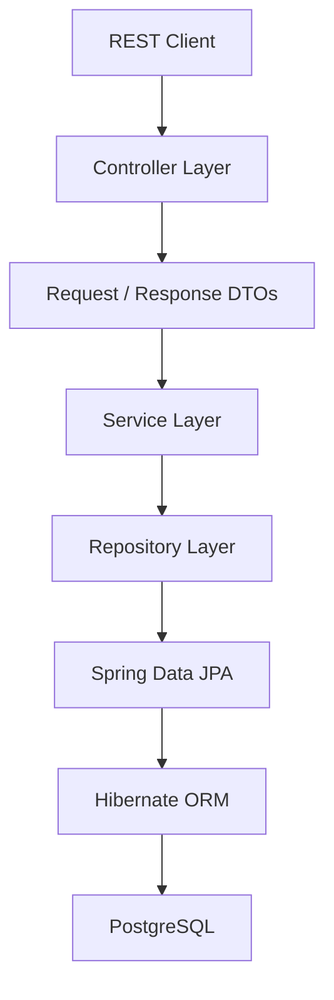
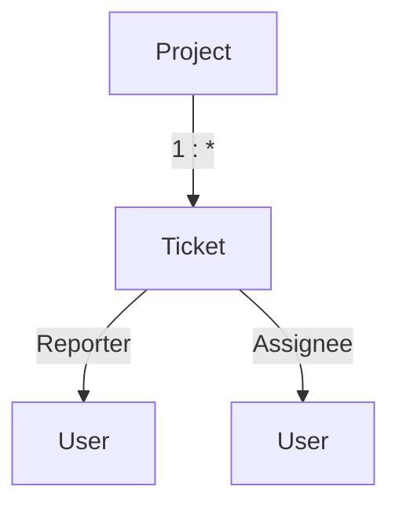

# ResolveHub

[](https://www.oracle.com/java/)
[](https://spring.io/projects/spring-boot)
[](https://maven.apache.org/)
[](https://www.postgresql.org/)
[](https://hibernate.org/)

**ResolveHub** is a backend issue-tracking and resolution platform built with **Java, Spring Boot, Spring MVC, Spring Data JPA, Hibernate, and PostgreSQL**.

The system models a real-world ticket management workflow where users can create, assign, update, filter, and track issues across projects.

The project focuses on building a maintainable REST backend while addressing practical concerns around **relational data modeling, dynamic querying, pagination, transaction management, and ORM performance**.

---

## Features

* RESTful APIs for project and ticket management
* Layered architecture with Controller, Service, Repository, and DTO layers
* Request validation using Jakarta Bean Validation
* Relational entity mapping using JPA and Hibernate
* Ticket assignment and project relationships
* Dynamic ticket filtering using JPA Specifications
* Pagination and sorting for ticket listings
* Interface-based projections for lightweight read operations
* Derived Spring Data JPA queries
* Custom JPQL and native SQL queries
* Transactional persistence and Hibernate dirty checking
* Lazy loading and relationship management
* N+1 query analysis and optimization using `JOIN FETCH`
* PostgreSQL-backed persistent storage

---

## Architecture



ResolveHub follows a layered backend architecture:

| Layer           | Responsibility                             |
| --------------- | ------------------------------------------ |
| Controller      | HTTP request handling and API endpoints    |
| DTO             | API request/response contracts             |
| Service         | Business logic and transactional workflows |
| Repository      | Data access and query definitions          |
| Entity          | Persistence model and relationships        |
| JPA / Hibernate | ORM and persistence management             |
| PostgreSQL      | Persistent relational storage              |

---

## Domain Model

ResolveHub is centered around **Projects, Tickets, and Users**.



### Ticket

```text
Ticket
├── id
├── title
├── description
├── status
├── priority
├── project
├── reporter
├── assignee
├── createdAt
└── updatedAt
```

A ticket belongs to a project and maintains relationships with users representing its reporter and assignee.

---

## REST API

ResolveHub exposes REST endpoints for managing tickets and querying ticket data.

### Ticket Management

```http
GET     /api/tickets
GET     /api/tickets/{id}
POST    /api/tickets
PUT     /api/tickets/{id}
PATCH   /api/tickets/{id}/status
DELETE  /api/tickets/{id}
```

### Filtering & Search

Ticket listings support multiple optional filters:

```http
GET /api/tickets?status=OPEN
GET /api/tickets?priority=HIGH
GET /api/tickets?projectId=1
GET /api/tickets?search=payment
```

Filters can also be combined:

```http
GET /api/tickets?status=OPEN&priority=HIGH&projectId=1&search=payment
```

### Pagination & Sorting

```http
GET /api/tickets?page=0&size=10
```

```text
GET /api/tickets?page=0&size=10&sort=createdAt,desc
```

Paginated responses provide information such as total elements, total pages, current page, and page size.

---

## Dynamic Filtering

Instead of maintaining separate repository methods for every possible filter combination, ResolveHub uses **JPA Specifications** to build queries dynamically.

For example:

```text
status
   +
priority
   +
project
   +
search
   ↓
JPA Specification
   ↓
Dynamic Query
   ↓
PostgreSQL
```

This allows new filters to be composed without creating a large number of repository methods such as:

```text
findByStatusAndPriorityAndProjectId(...)
findByStatusAndProjectId(...)
findByPriorityAndProjectId(...)
findByStatusAndPriority(...)
...
```

---

## Querying Strategy

ResolveHub uses multiple querying approaches depending on the use case.

### Derived Queries

Used for straightforward repository operations:

```java
findByStatus(String status)
```

### JPQL

Used for entity-oriented custom queries:

```java
@Query("""
    SELECT t
    FROM Ticket t
    WHERE t.status = :status
""")
List<Ticket> findTicketsByStatus(
    @Param("status") String status
);
```

### Native SQL

Used where direct database-level querying is appropriate:

```java
@Query(
    value = """
        SELECT *
        FROM tickets
        WHERE status = :status
    """,
    nativeQuery = true
)
List<Ticket> findNativeByStatus(
    @Param("status") String status
);
```

The project therefore demonstrates the practical trade-offs between **derived queries, JPQL, and native SQL**.

---

## Projections

For lightweight read operations, ResolveHub uses **interface-based projections** to retrieve only the fields required by the API.

```java
public interface TicketSummary {

    Long getId();

    String getTitle();

    String getStatus();

    String getPriority();

    String getProjectName();
}
```

This avoids loading the complete entity when only a small subset of fields is required.

---

## ORM Performance

A major focus of ResolveHub is understanding and controlling the SQL generated by Hibernate.

### N+1 Query Problem

When related entities are accessed inefficiently, a single ticket query can result in additional queries for related projects or users.

```text
1 query
   ↓
N tickets
   ↓
N additional relationship queries
   ↓
N + 1 queries
```

ResolveHub addresses this using intentional fetching strategies where appropriate.

### JOIN FETCH

For use cases that require related entities together:

```java
@Query("""
    SELECT t
    FROM Ticket t
    JOIN FETCH t.project
    JOIN FETCH t.reporter
    WHERE t.id = :id
""")
Optional<Ticket> findTicketWithProjectAndReporter(
    @Param("id") Long id
);
```

The goal is not to make relationships globally eager, but to **choose the appropriate fetching strategy based on the query and use case**.

---

## Persistence & Transactions

ResolveHub uses JPA's **Persistence Context** and Hibernate's dirty checking to manage entity state.

For example:

```java
ticket.setStatus("RESOLVED");
```

When the entity is managed within a transaction, Hibernate detects the state change and synchronizes the corresponding update with the database during flush/commit.

This keeps persistence logic focused on entity state and business operations rather than manually constructing SQL updates.

---

## Validation & DTOs

API requests are represented using dedicated DTOs rather than exposing JPA entities directly.

```text
HTTP Request
     ↓
CreateTicketRequest
     ↓
Validation
     ↓
Service
     ↓
Ticket Entity
     ↓
Repository
     ↓
PostgreSQL
```

Example validation:

```java
public class CreateTicketRequest {

    @NotBlank
    private String title;

    @NotBlank
    private String description;
}
```

This keeps the API contract separate from the persistence model and prevents invalid requests from reaching the service layer.

---

## Project Structure

```text
src/
└── main/
    └── java/
        └── com/
            └── ayesha/
                └── resolvehub/
                    ├── controller/
                    ├── dto/
                    ├── entity/
                    ├── exception/
                    ├── repository/
                    │   └── projection/
                    └── service/
```

The package structure separates HTTP handling, business logic, persistence, API models, and exception handling.

---

## Engineering Highlights

### Relational Data Modeling

Designed entity relationships between projects, tickets, reporters, and assignees using JPA/Hibernate.

### Dynamic Querying

Implemented composable ticket filters using **JPA Specifications** rather than maintaining repository methods for every filter combination.

### Efficient Data Retrieval

Used **pagination, sorting, and interface-based projections** to avoid unnecessary data retrieval for list and summary endpoints.

### ORM Performance

Investigated Hibernate-generated queries and addressed the **N+1 query problem** using targeted `JOIN FETCH` queries.

### Persistence Management

Worked with the **Persistence Context, entity lifecycle, dirty checking, and transactional operations** to understand and control Hibernate persistence behavior.

---

## Tech Stack

| Technology         | Purpose                         |
| ------------------ | ------------------------------- |
| Java 21            | Core application development    |
| Spring Boot        | Application framework           |
| Spring MVC         | REST API and request handling   |
| Spring Data JPA    | Data access abstraction         |
| Hibernate          | ORM implementation              |
| PostgreSQL         | Relational database             |
| Maven              | Build and dependency management |
| Lombok             | Boilerplate reduction           |
| Jakarta Validation | Request validation              |

---

## Getting Started

### Prerequisites

* Java 21
* Maven
* PostgreSQL

### Clone

```bash
git clone https://github.com/<your-username>/ResolveHub.git
cd ResolveHub
```

### Database Configuration

Create a PostgreSQL database and configure the datasource in:

```text
src/main/resources/application.properties
```

Example:

```properties
spring.datasource.url=jdbc:postgresql://localhost:5432/resolvehub
spring.datasource.username=postgres
spring.datasource.password=your_password

spring.jpa.hibernate.ddl-auto=update
spring.jpa.show-sql=true
```

### Build

```bash
mvn clean install
```

### Run

```bash
mvn spring-boot:run
```

The application runs by default on:

```text
http://localhost:8080
```

---

<!-- ## Roadmap

* [ ] Transactional ticket workflows
* [ ] Ticket assignment workflow
* [ ] Ticket activity/history
* [ ] Comments and discussions
* [ ] Global exception handling
* [ ] Consistent API response structure
* [ ] Unit and integration testing
* [ ] OpenAPI / Swagger documentation
* [ ] Logging and observability
* [ ] Dockerized application and PostgreSQL
* [ ] Production-oriented configuration
* [ ] Database and API performance optimization -->

---

## Future Direction

ResolveHub is being evolved toward a production-oriented issue-tracking backend, with upcoming work focused on **testing, transactional workflows, observability, API documentation, containerization, and further performance optimization**.

---

**ResolveHub**
Java · Spring Boot · JPA · Hibernate · PostgreSQL

© 2026 Ayesha
