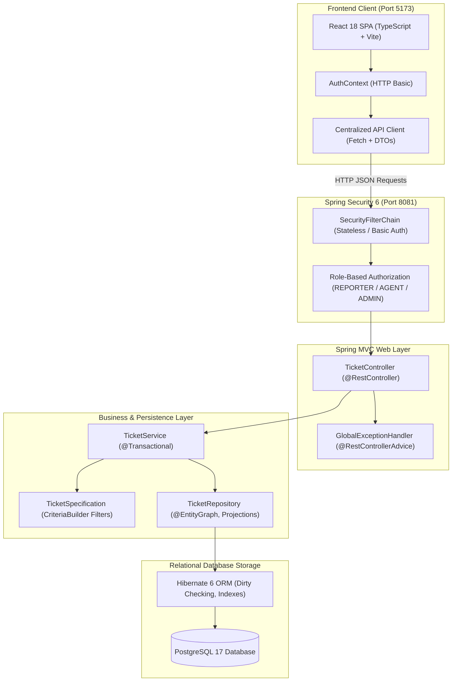
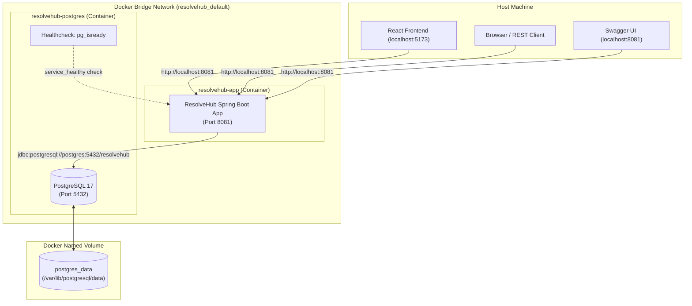

# ResolveHub

[](https://www.oracle.com/java/)
[](https://spring.io/projects/spring-boot)
[](https://spring.io/projects/spring-security)
[](https://react.dev/)
[](https://www.typescriptlang.org/)
[](https://vitejs.dev/)
[](https://www.docker.com/)
[](https://www.postgresql.org/)
[](http://localhost:8081/swagger-ui.html)
[](src/test/java)

**ResolveHub** is an enterprise-grade issue-tracking and resolution platform built with **Java 21, Spring Boot, Spring Security, Spring MVC, Spring Data JPA, Hibernate, PostgreSQL, Docker Compose, and a React + TypeScript frontend**.

The system models a real-world ticket management workflow where users authenticate via **HTTP Basic Auth**, are authorized using strict **Role-Based Access Control (RBAC)** (`REPORTER`, `AGENT`, `ADMIN`), and can create, assign, update, filter, comment on, and audit issues across projects with transaction-safe state machines and centralized error handling.

---

## Table of Contents
- [Full-Stack Architecture](#full-stack-architecture)
- [Frontend (React + TypeScript + Vite)](#frontend-react--typescript--vite)
- [Quickstart with Docker Compose](#quickstart-with-docker-compose)
- [Docker Architecture & Networking](#docker-architecture--networking)
- [Features](#features)
- [Architecture & Security Flow](#architecture--security-flow)
- [Security & Authentication Model](#security--authentication-model)
- [Domain Model](#domain-model)
- [OpenAPI & Swagger UI](#openapi--swagger-ui)
- [REST API Endpoints & Permissions](#rest-api-endpoints--permissions)
- [Dynamic Filtering & Search](#dynamic-filtering--search)
- [Audit Activities & Comments](#audit-activities--comments)
- [Global Exception Handling](#global-exception-handling)
- [Environment Configuration & Profiles](#environment-configuration--profiles)
- [Automated Testing](#automated-testing)
- [Docker Commands Cheat Sheet](#docker-commands-cheat-sheet)
- [Project Structure](#project-structure)

---

## Full-Stack Architecture



---

## Frontend (React + TypeScript + Vite)

The frontend is a portfolio presentation layer designed to showcase the Spring Boot backend with a real issue-tracking UI.

### Key Capabilities
- **Role-Aware UI**: Automatically adapts UI controls according to user role (`REPORTER` can only view and create; `AGENT` can assign and transition status; `ADMIN` can delete tickets).
- **Dynamic Search Toolbar**: Uses backend JPA Specifications to filter by keyword, status, priority, project, assignee, and dates.
- **Server-Side Pagination & Sorting**: Leverages Spring Data's `Page<T>` with page size and whitelist sorting controls.
- **Ticket Workflow State Machine**: Step-by-step status transitions (`OPEN` $\rightarrow$ `IN_PROGRESS` $\rightarrow$ `RESOLVED` $\rightarrow$ `CLOSED`).
- **Discussion Comments**: Paginated comments thread with author attribution.
- **Audit Activity Timeline**: Chronological history trail tracking all ticket modifications.

### Running the Frontend
```bash
cd frontend
npm install
npm run dev
```
Open [`http://localhost:5173`](http://localhost:5173) in your browser.

#### Demo Credentials:
| Role | Email | Password | Allowed Operations |
|---|---|---|---|
| **Admin** | `admin@resolvehub.com` | `admin123` | Full access (Delete, Status, Assign, Edit, Create) |
| **Agent** | `agent@resolvehub.com` | `agent123` | Support Agent (Status transitions, Assignment, Edit, Create) |
| **Reporter** | `reporter@resolvehub.com` | `reporter123` | Reporter (Browse, Search, Create Tickets, Post Comments) |

---

## Quickstart with Docker Compose

Running ResolveHub with a production-grade PostgreSQL database requires only Docker and Docker Compose.

### 1. Clone & Configure Environment
```bash
git clone https://github.com/ayesha/ResolveHub.git
cd ResolveHub

# Optional: customize local environment settings
cp .env.example .env
```

### 2. Build and Start Services
```bash
docker compose up --build -d
```

### 3. Verify Container Status
```bash
docker compose ps
```
You should see `resolvehub-postgres` marked as `healthy` and `resolvehub-app` running on port `8081`.

### 4. Explore Interactive API Documentation
Open your browser and navigate to:
- **Swagger UI**: [`http://localhost:8081/swagger-ui.html`](http://localhost:8081/swagger-ui.html)
- **OpenAPI 3.0 Spec**: [`http://localhost:8081/v3/api-docs`](http://localhost:8081/v3/api-docs)

Click the **Authorize** button and log in with default development credentials.

### 5. Stop Containers
```bash
# Stop containers while preserving database volume
docker compose down
```

---

## Docker Architecture & Networking



---

## Features

- **React + TypeScript SPA**: Clean dashboard with role-aware UI controls, dynamic filtering, server pagination, comments, and audit timeline.
- **Containerized Deployment**: Multi-stage Dockerfile using Eclipse Temurin Java 21 with a lightweight non-root runtime container.
- **Docker Compose Orchestration**: Automated PostgreSQL provisioning, health checks (`pg_isready`), and dependency sequencing (`condition: service_healthy`).
- **Role-Based Access Control (RBAC)**: Spring Security integration with `REPORTER`, `AGENT`, and `ADMIN` roles.
- **BCrypt Password Hashing**: Passwords hashed with salted BCrypt before persistence and strictly protected from JSON serialization and logs.
- **Stateless REST Security**: HTTP Basic authentication over stateless sessions with explicit CSRF disabling justification.
- **Interactive OpenAPI Documentation**: Embedded Swagger UI 3.0 specification with `basicAuth` authentication support.
- **Transactional State Transitions**: Enforces valid ticket status transitions (`OPEN` $\rightarrow$ `IN_PROGRESS` $\rightarrow$ `RESOLVED` $\rightarrow$ `CLOSED`).
- **Dynamic Filtering with JPA Specifications**: Composable multi-criteria search without combinatorial repository methods.
- **Database Pagination & Whitelist Sorting**: Database-level `LIMIT`/`OFFSET` queries with sort field whitelisting to protect against injection.
- **Database Indexes**: Optimized indexes on status, priority, project_id, assignee_id, reporter_id, and created_at.
- **Automated Audit Logging**: Append-only activity history tracking ticket creation, status changes, assignments, and priority updates.
- **Paginated Discussions**: Ticket comments with author metadata and N+1 query prevention using `@EntityGraph`.
- **Centralized Exception Handling**: Uniform REST error responses via `@RestControllerAdvice` and `ApiErrorResponse` DTOs.
- **Comprehensive Automated Test Suite**: 57 automated tests covering Security, Unit, MockMvc, JPA Data, and Integration workflows.

---

## REST API Endpoints & Permissions

| Method | Endpoint | Required Role | Description |
|---|---|---|---|
| `GET` | `/v3/api-docs/**` | `PUBLIC` | Raw OpenAPI 3.0 specification |
| `GET` | `/swagger-ui/**` | `PUBLIC` | Interactive Swagger UI assets |
| `GET` | `/api/tickets` | `REPORTER`, `AGENT`, `ADMIN` | Search tickets with dynamic filters, pagination, and sorting |
| `GET` | `/api/tickets/{id}` | `REPORTER`, `AGENT`, `ADMIN` | Retrieve single ticket details by ID |
| `POST` | `/api/tickets` | `REPORTER`, `AGENT`, `ADMIN` | Create a new ticket (status `OPEN`, logs `CREATED` activity) |
| `PUT` | `/api/tickets/{id}` | `AGENT`, `ADMIN` | Update ticket title, description, and priority |
| `PATCH` | `/api/tickets/{id}/assignee` | `AGENT`, `ADMIN` | Assign ticket to user (logs `ASSIGNED` activity) |
| `PATCH` | `/api/tickets/{id}/status` | `AGENT`, `ADMIN` | Transition ticket status (`OPEN` $\rightarrow$ `IN_PROGRESS` $\rightarrow$ `RESOLVED` $\rightarrow$ `CLOSED`) |
| `PATCH` | `/api/tickets/{id}/assign-and-start` | `AGENT`, `ADMIN` | Atomically assign ticket and set status to `IN_PROGRESS` |
| `GET` | `/api/tickets/{id}/activities` | `REPORTER`, `AGENT`, `ADMIN` | Retrieve audit history ordered newest to oldest |
| `POST` | `/api/tickets/{id}/comments` | `REPORTER`, `AGENT`, `ADMIN` | Add a discussion comment to a ticket |
| `GET` | `/api/tickets/{id}/comments` | `REPORTER`, `AGENT`, `ADMIN` | Retrieve paginated comments for a ticket (newest first) |
| `DELETE` | `/api/tickets/{id}` | `ADMIN` (`@PreAuthorize`) | Delete ticket (cascades to activities and comments) |

---

## Dynamic Filtering & Search

The search endpoint `GET /api/tickets` uses composable **Spring Data JPA Specifications** to generate optimized SQL `WHERE` clauses dynamically:

### Supported Query Parameters
- `status`: e.g. `OPEN`, `IN_PROGRESS`, `RESOLVED`, `CLOSED`
- `priority`: e.g. `LOW`, `MEDIUM`, `HIGH`, `CRITICAL`
- `projectId`: Filter by project ID
- `assigneeId`: Filter by assigned user ID
- `reporterId`: Filter by reporting user ID
- `search`: Case-insensitive text search matching `title` OR `description`
- `createdAfter` / `createdBefore`: ISO-8601 timestamps (`YYYY-MM-DDTHH:MM:SS`)
- `page`: Page index (default `0`)
- `size`: Page size (default `10`, max `100`)
- `sort`: Whitelisted sort field (`createdAt`, `updatedAt`, `priority`, `status`, `title`, `id`)
- `direction`: `asc` or `desc` (default `desc`)

---

## Global Exception Handling

All API errors are intercepted by `GlobalExceptionHandler` (`@RestControllerAdvice`) and formatted as a consistent `ApiErrorResponse`:

```json
{
  "timestamp": "2026-08-30T22:35:00",
  "status": 403,
  "error": "Forbidden",
  "message": "Access denied: insufficient permissions to access this resource",
  "path": "/api/tickets/1"
}
```

---

## Automated Testing

ResolveHub includes 57 automated backend tests with 100% pass rate:

```bash
mvn clean test
```

### Test Suite Summary
1. **Security Integration Tests (`SecurityIntegrationTest`)**: 10 tests verifying 401 unauthenticated, 401 invalid credentials, 403 RBAC violations, 200 permitted role actions, Swagger doc availability, and password non-leakage.
2. **Service Unit Tests (`TicketServiceTest`)**: 23 Mockito tests verifying business rules, workflows, status transitions, activities, and comments.
3. **Controller Tests (`TicketControllerTest`)**: 14 Web-layer MockMvc tests with `@WithMockUser` verifying validation and DTO mapping.
4. **Repository Tests (`TicketRepositoryTest`)**: 9 `@DataJpaTest` tests verifying Specifications, date queries, and `@EntityGraph`.
5. **Workflow Integration Tests (`TicketWorkflowIntegrationTest`)**: 1 `@SpringBootTest` validating full multi-step ticket lifecycles.

---

## Docker Commands Cheat Sheet

| Command | Purpose |
|---|---|
| `docker compose up --build -d` | Build images, start containers in background, and create volumes |
| `docker compose ps` | View status and health of all orchestrated containers |
| `docker compose logs -f app` | Follow real-time application logs for ResolveHub |
| `docker compose logs -f postgres` | Follow real-time PostgreSQL database logs |
| `docker compose down` | Gracefully stop and remove containers and network (**preserves database data**) |
| `docker compose down -v` | Stop containers and **delete all database volumes** (wipes persistent storage) |

---

## Project Structure

```text
ResolveHub/
├── frontend/                   # React + TypeScript + Vite SPA
│   ├── src/
│   │   ├── api/                # Typed REST API client layer (Fetch + Basic Auth)
│   │   ├── components/         # Layout, Navbar, Sidebar, Badges, Pagination, Modal
│   │   ├── context/            # AuthContext (Role management & session)
│   │   ├── pages/              # Login, Dashboard, TicketList, TicketDetail, CreateTicket
│   │   ├── types/              # TypeScript models mirroring backend DTOs
│   │   ├── App.tsx
│   │   └── main.tsx
│   ├── package.json
│   ├── tsconfig.json
│   └── vite.config.ts
├── docs/
│   └── PROJECT_SUMMARY.md      # Technical revision guide (WHAT / WHY / HOW for 25 topics)
├── src/
│   ├── main/
│   │   ├── java/com/ayesha/resolvehub/
│   │   │   ├── config/         # SecurityConfig (CORS, RBAC), OpenApiConfig, SecurityDataInitializer
│   │   │   ├── controller/     # REST API endpoints & Swagger annotations
│   │   │   ├── dto/            # Request & Response DTOs with @Schema
│   │   │   ├── entity/         # JPA Entities (User, Role, Ticket, Project, Activity, Comment)
│   │   │   ├── exception/      # Domain exceptions & GlobalExceptionHandler
│   │   │   ├── repository/     # Spring Data repositories & JPA Specifications
│   │   │   ├── security/       # CustomUserDetailsService
│   │   │   └── service/        # Transactional business logic & state transitions
│   │   └── resources/
│   └── test/
│       ├── java/com/ayesha/resolvehub/
│       │   ├── controller/     # TicketControllerTest (MockMvc + @WithMockUser)
│       │   ├── integration/    # SecurityIntegrationTest, TicketWorkflowIntegrationTest
│       │   ├── repository/     # TicketRepositoryTest (DataJpaTest)
│       │   └── service/        # TicketServiceTest (Mockito)
├── .dockerignore
├── .env.example
├── Dockerfile
├── docker-compose.yml
└── pom.xml
```

---

**ResolveHub** · Java 21 · Spring Boot 3.5.5 · Spring Security 6 · React 18 · TypeScript · PostgreSQL 17 · Docker Compose  
© 2026 Ayesha
