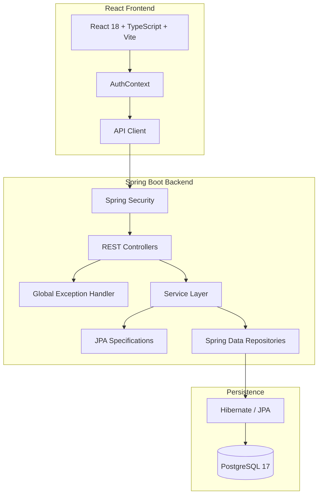

# ResolveHub


ResolveHub is a full-stack issue tracking and ticket management system built to explore how a real-world backend handles **authentication, authorization, ticket workflows, relational data, search, pagination, transactions, and audit history**.

The backend is built with **Java 21 and Spring Boot**, backed by **PostgreSQL**, while the frontend is a small **React + TypeScript** application. The project is also containerized with Docker Compose.

A major focus of the project was not just getting the CRUD operations working, but understanding what happens around them — things like preventing invalid state changes, avoiding N+1 queries, keeping multi-step operations atomic, and designing APIs that remain predictable as features are added.

---

## What ResolveHub Does

A ticket can move through the following workflow:

```text
OPEN → IN_PROGRESS → RESOLVED → CLOSED
```

Different users have different responsibilities:

* **REPORTER** — can create tickets, view tickets, and participate in discussions
* **AGENT** — can work on tickets, assign them, update details, and change their status
* **ADMIN** — has full access, including deleting tickets

Every important ticket change is recorded in an activity history so that changes such as assignments, priority updates, and status transitions can be tracked.

---

## Key Features

### Authentication & Authorization

* HTTP Basic Authentication using Spring Security
* Role-based access control for `REPORTER`, `AGENT`, and `ADMIN`
* BCrypt password hashing
* Method-level authorization with `@PreAuthorize`
* Consistent `401` and `403` responses
* Passwords are excluded from API responses

### Ticket Workflow

* Explicit ticket state transitions
* Invalid status changes are rejected
* Assignment and status updates can happen as part of the same transaction
* Ticket activity is recorded whenever important changes occur

### Search & Filtering

Tickets can be searched using multiple filters at the same time:

* Status
* Priority
* Project
* Assignee
* Reporter
* Keyword
* Creation date range

The filtering is implemented using **Spring Data JPA Specifications**, rather than creating a separate repository method for every possible combination.

For example:

```text
GET /api/tickets?status=OPEN&priority=HIGH&search=payment&projectId=1&page=0&size=10
```

### Pagination & Sorting

* Pagination is handled on the database side using Spring Data `Pageable`
* Page size is limited to 100 records
* Sort fields are whitelisted
* Invalid sort fields return a `400 Bad Request`

Supported sort fields:

```text
createdAt
updatedAt
priority
status
title
id
```

### Audit History

Important ticket changes create an append-only `TicketActivity` record containing:

* Action performed
* Human-readable description
* Previous value
* New value
* Timestamp

For example:

```text
STATUS_CHANGED
OPEN → IN_PROGRESS
```

### Comments

Tickets support discussion threads with:

* Comment authors
* Timestamps
* Paginated responses
* Optimized author fetching

### N+1 Query Prevention

Ticket comments contain a relationship to their author. Loading each author separately can result in the classic N+1 query problem.

For the relevant repository query, `@EntityGraph` is used to fetch the author together with the comments:

```java
@EntityGraph(attributePaths = {"author"})
Page<TicketComment> findByTicketIdOrderByCreatedAtDesc(
        Long ticketId,
        Pageable pageable
);
```

This keeps the relationship `LAZY` by default while fetching the data needed by that endpoint in a single query.

### Centralized Error Handling

The API uses a common error response format for:

* Validation errors
* Authentication failures
* Authorization failures
* Missing resources
* Invalid sorting parameters

### Docker Support

The project includes a Docker Compose setup containing:

* Spring Boot application
* PostgreSQL 17
* PostgreSQL health checks
* Persistent database volume
* Multi-stage Java Docker build
* Non-root application runtime

### React Frontend

The frontend is intentionally lightweight and provides:

* Ticket listing
* Search and filtering
* Role-aware actions
* Ticket status workflows
* Discussion/comments
* TypeScript-based API communication

---

## Architecture



### Request Flow

A typical request follows this path:

```text
React Client
    ↓
HTTP Request
    ↓
Spring Security
    ↓
Authentication + Role Check
    ↓
Controller
    ↓
DTO Validation
    ↓
Service Layer
    ↓
Business Rules / Transactions
    ↓
Repository
    ↓
Hibernate
    ↓
PostgreSQL
```

Keeping the business logic in the service layer also makes it easier to keep transactions and domain rules in one place instead of spreading them across controllers and repositories.

---

## Tech Stack

| Layer               | Technology                         |
| ------------------- | ---------------------------------- |
| Language            | Java 21                            |
| Backend             | Spring Boot 3.5.5                  |
| Security            | Spring Security 6                  |
| ORM                 | Hibernate 6 / Spring Data JPA      |
| Database            | PostgreSQL 17                      |
| API Documentation   | Springdoc OpenAPI / Swagger        |
| Testing             | JUnit 5, Mockito, MockMvc, AssertJ |
| Frontend            | React 18                           |
| Frontend Language   | TypeScript 5.6                     |
| Frontend Build Tool | Vite 6                             |
| Styling             | Tailwind CSS                       |
| Containerization    | Docker / Docker Compose            |

---

## API

The main API endpoints are:

| Method   | Endpoint                             | Description                 | Role         |
| -------- | ------------------------------------ | --------------------------- | ------------ |
| `GET`    | `/api/tickets`                       | Search and paginate tickets | All roles    |
| `GET`    | `/api/tickets/{id}`                  | Get ticket details          | All roles    |
| `POST`   | `/api/tickets`                       | Create a ticket             | All roles    |
| `PUT`    | `/api/tickets/{id}`                  | Update ticket details       | AGENT, ADMIN |
| `PATCH`  | `/api/tickets/{id}/assignee`         | Assign a ticket             | AGENT, ADMIN |
| `PATCH`  | `/api/tickets/{id}/status`           | Change ticket status        | AGENT, ADMIN |
| `PATCH`  | `/api/tickets/{id}/assign-and-start` | Assign and start a ticket   | AGENT, ADMIN |
| `GET`    | `/api/tickets/{id}/activities`       | View ticket history         | All roles    |
| `POST`   | `/api/tickets/{id}/comments`         | Add a comment               | All roles    |
| `GET`    | `/api/tickets/{id}/comments`         | Get paginated comments      | All roles    |
| `DELETE` | `/api/tickets/{id}`                  | Delete a ticket             | ADMIN        |

Swagger UI and the OpenAPI specification are also available when the application is running.

---

## Authentication & Roles

ResolveHub uses HTTP Basic Authentication with three roles.

| Operation             | REPORTER | AGENT | ADMIN |
| --------------------- | :------: | :---: | :---: |
| View & search tickets |     ✓    |   ✓   |   ✓   |
| Create ticket         |     ✓    |   ✓   |   ✓   |
| Add comments          |     ✓    |   ✓   |   ✓   |
| Update ticket         |     —    |   ✓   |   ✓   |
| Assign ticket         |     —    |   ✓   |   ✓   |
| Change status         |     —    |   ✓   |   ✓   |
| Delete ticket         |     —    |   —   |   ✓   |

Passwords are hashed using `BCryptPasswordEncoder` before being stored.

For local development, the application seeds test users when running outside the test and production profiles.

> These credentials are intended only for local development. They should be changed or removed before deploying the application.

---

## Data Model

The main relationships look like this:

```text
User
 ├── owns → Project
 ├── reports → Ticket
 └── assigned to → Ticket

Project
 └── contains → Ticket

Ticket
 ├── has → TicketComment
 └── has → TicketActivity
```

Entity relationships are kept `LAZY` by default, with specific fetch plans used where an endpoint needs related data.

For example, comments use an `@EntityGraph` when their author information is required.

---

## Database & Indexing

The ticket table contains indexes for the fields used frequently in filtering, joining, and sorting:

```text
status
priority
project_id
assignee_id
reporter_id
created_at
```

There are also indexes on `ticket_id` and `created_at` for comments and activity history.

This is especially useful for endpoints that combine filtering with pagination rather than loading the entire ticket table into memory.

---

## Transactions

Several operations involve more than one database change, so they run inside a single transaction.

For example, creating a ticket involves:

```text
Create Ticket
     ↓
Save Ticket
     ↓
Create "CREATED" Activity
     ↓
Commit
```

Similarly, assigning a ticket can update the assignee, change its status, and create an activity entry as one atomic operation.

The service layer uses `@Transactional` for these workflows.

Hibernate's dirty checking also allows changes to managed entities to be persisted when the transaction commits without requiring an explicit `save()` for every modification.

---

## Some Engineering Decisions

### Why a Modular Monolith?

I chose a modular monolith because the application has closely related data and workflows.

Tickets, users, projects, comments, and activities frequently participate in the same operations. Keeping them within one application makes transactions straightforward and avoids introducing network communication and distributed-system complexity before it is actually needed.

If the system grew significantly, individual modules could later be separated based on actual scaling or ownership requirements.

### Why PostgreSQL?

The data is strongly relational:

```text
User → Project → Ticket → Comments / Activities
```

PostgreSQL provides the foreign keys, transactions, indexing, and querying capabilities that fit this model well.

### Why DTOs?

Controllers don't return JPA entities directly.

Using request and response DTOs helps keep the API contract separate from the persistence model and avoids exposing fields that shouldn't be part of the API.

It also prevents problems caused by lazy relationships during JSON serialization.

### Why JPA Specifications?

There are several optional ticket filters.

With normal repository methods, combinations of these filters can quickly result in a large number of query methods.

Specifications allow the filters to be composed only when they are actually provided:

```text
status
   +
priority
   +
project
   +
assignee
   +
search
   +
date range
```

This keeps the repository interface much smaller.

### Why `@EntityGraph`?

Relationships stay `LAZY` by default instead of making every query fetch everything.

When a particular endpoint needs related data, an `@EntityGraph` can specify exactly what should be fetched.

This gives more control over the SQL generated by Hibernate and helps avoid unnecessary N+1 queries.

### Why Whitelist Sorting?

The client can request a sort field, but it cannot choose an arbitrary entity property.

Only known fields such as `createdAt`, `priority`, and `status` are accepted.

This keeps the API predictable and prevents invalid sort properties from reaching the persistence layer.

### Why HTTP Basic?

For this project, HTTP Basic keeps authentication simple and stateless while allowing the security model and RBAC implementation to be demonstrated clearly.

For a production deployment, I would replace this with OAuth2/OIDC or another token-based authentication mechanism rather than exposing Basic credentials over the network.

---

## Testing

ResolveHub currently has **57 automated tests**, all passing.

```bash
mvn clean test
```

| Test Area  | Test Class                      |  Tests | What It Covers                                             |
| ---------- | ------------------------------- | :----: | ---------------------------------------------------------- |
| Security   | `SecurityIntegrationTest`       |   10   | Authentication, RBAC, 401/403, public Swagger endpoints    |
| Controller | `TicketControllerTest`          |   14   | Routing, validation, serialization, error handling         |
| Service    | `TicketServiceTest`             |   23   | Business rules, state transitions, assignments, activities |
| Repository | `TicketRepositoryTest`          |    9   | Queries, Specifications, EntityGraph, H2                   |
| Workflow   | `TicketWorkflowIntegrationTest` |    1   | End-to-end ticket lifecycle                                |
| **Total**  |                                 | **57** | **All passing**                                            |

The tests are split between unit tests, MVC tests, repository tests, security integration tests, and a full workflow integration test.

---

## API Documentation

ResolveHub uses Springdoc OpenAPI to generate API documentation.

Once the backend is running:

```text
Swagger UI
http://localhost:8081/swagger-ui.html

OpenAPI JSON
http://localhost:8081/v3/api-docs
```

Secured endpoints can be tested through Swagger UI using the **Authorize** button and the local HTTP Basic credentials.

---

## Running Locally

### Prerequisites

Make sure you have:

* Java 21
* Maven 3.9+
* PostgreSQL 17, or Docker
* Node.js 20+
* npm

### 1. Clone the repository

```bash
git clone https://github.com/ayesha19765/ResolveHub.git
cd ResolveHub
```

### 2. Configure environment variables

```bash
cp .env.example .env
```

Update the values in `.env` if your local PostgreSQL configuration is different.

### 3. Start the backend

```bash
mvn spring-boot:run
```

The backend runs on:

```text
http://localhost:8081
```

### 4. Start the frontend

```bash
cd frontend
npm install
npm run dev
```

The frontend runs on:

```text
http://localhost:5173
```

---

## Running with Docker

The project also includes a Docker Compose setup for running the backend and PostgreSQL together.

```bash
# Build and start the application
docker compose up --build -d

# Check container status
docker compose ps

# View application logs
docker compose logs -f app

# Stop containers
docker compose down

# Stop containers and remove the database volume
docker compose down -v
```

The PostgreSQL data is stored in a persistent Docker volume unless the volume is explicitly removed.

---

## Configuration

The application reads the following environment variables:

| Variable                 | Default                                       | Description               |
| ------------------------ | --------------------------------------------- | ------------------------- |
| `DB_URL`                 | `jdbc:postgresql://localhost:5432/resolvehub` | PostgreSQL connection URL |
| `DB_USERNAME`            | `postgres`                                    | Database username         |
| `DB_PASSWORD`            | `password`                                    | Database password         |
| `HIBERNATE_DDL_AUTO`     | `update`                                      | Hibernate schema mode     |
| `SHOW_SQL`               | `false`                                       | Enable SQL logging        |
| `SPRING_PROFILES_ACTIVE` | `dev`                                         | Active Spring profile     |

When running through Docker Compose, the database hostname is the PostgreSQL service name rather than `localhost`.

---

## Trade-offs

A few decisions in the project were intentionally made for simplicity:

* **Basic Auth instead of OAuth2/OIDC** — keeps the authentication flow simple for this implementation.
* **JPA Specifications instead of QueryDSL** — avoids adding another query-generation dependency while still supporting dynamic filtering.
* **Selective `@EntityGraph` instead of EAGER relationships** — avoids fetching unnecessary data for unrelated endpoints.
* **Single application instead of microservices** — the current domain doesn't justify the operational overhead of distributed services.

---

## Current Limitations

ResolveHub is primarily a learning and portfolio project, so there are some things I would change for a larger production deployment:

* HTTP Basic would be replaced with OAuth2/OIDC or JWT-based authentication.
* There is no distributed rate limiting yet.
* The application currently assumes a single-node deployment.
* Audit events are written synchronously as part of the ticket transaction.

---

## Possible Next Steps

Some improvements I'd consider next:

* OAuth2 / OIDC authentication
* Asynchronous audit event processing
* Redis caching for frequently accessed dashboard data
* File attachments using S3 or MinIO
* Distributed rate limiting
* Horizontal deployment with multiple application instances
* More extensive performance testing

---

## License

This project is licensed under the MIT License.

---

**ResolveHub**
Java 21 · Spring Boot 3.5.5 · Spring Security 6 · React 18 · TypeScript · PostgreSQL 17 · Docker Compose

© 2026 Ayesha
