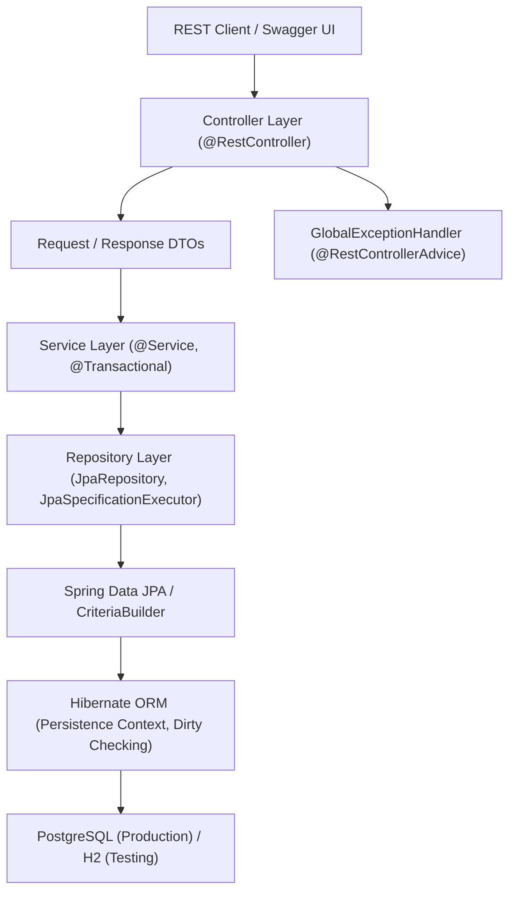
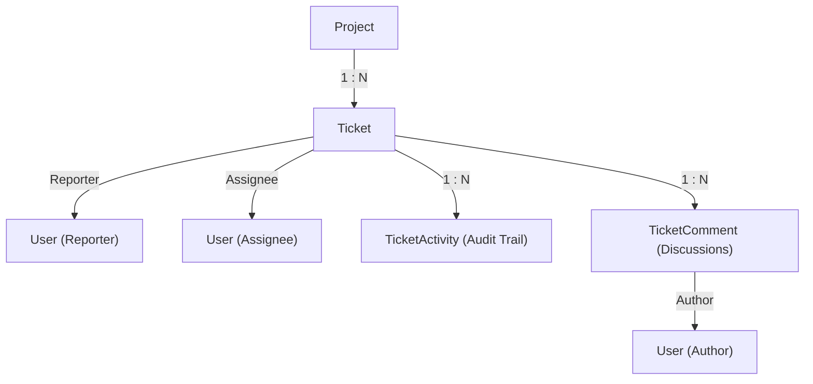

# ResolveHub

[](https://www.oracle.com/java/)
[](https://spring.io/projects/spring-boot)
[](https://maven.apache.org/)
[](https://www.postgresql.org/)
[](https://hibernate.org/)
[](http://localhost:8081/swagger-ui.html)
[](src/test/java)

**ResolveHub** is a backend issue-tracking and resolution platform built with **Java 21, Spring Boot, Spring MVC, Spring Data JPA, Hibernate, and PostgreSQL**.

The system models a real-world ticket management workflow where users can create, assign, update, filter, comment on, and audit issues across projects with strict state machines, database pagination, dynamic querying, and centralized exception handling.

---

## Table of Contents
- [Features](#features)
- [Architecture](#architecture)
- [Domain Model](#domain-model)
- [OpenAPI & Swagger UI](#openapi--swagger-ui)
- [REST API Endpoints](#rest-api-endpoints)
- [Dynamic Filtering & Search](#dynamic-filtering--search)
- [Audit Activities & Comments](#audit-activities--comments)
- [Global Exception Handling](#global-exception-handling)
- [Environment Configuration & Profiles](#environment-configuration--profiles)
- [Automated Testing](#automated-testing)
- [Getting Started](#getting-started)
- [Project Structure](#project-structure)

---

## Features

- **Layered Architecture**: Strict separation of concerns across Controller, DTO, Service, Repository, and Entity layers.
- **Transactional State Transitions**: Enforces valid ticket status transitions (`OPEN` $\rightarrow$ `IN_PROGRESS` $\rightarrow$ `RESOLVED` $\rightarrow$ `CLOSED`).
- **Dynamic Filtering with JPA Specifications**: Composable multi-criteria search without combinatorial repository methods.
- **Database Pagination & Whitelist Sorting**: Database-level `LIMIT`/`OFFSET` queries with sort field whitelisting to protect against injection.
- **Automated Audit Logging**: Append-only activity history tracking ticket creation, status changes, assignments, and priority updates.
- **Paginated Discussions**: Ticket comments with author metadata and N+1 query prevention using `@EntityGraph`.
- **Centralized Exception Handling**: Uniform REST error responses via `@RestControllerAdvice` and `ApiErrorResponse` DTOs.
- **Interactive OpenAPI Documentation**: Embedded Swagger UI 3.0 specification powered by Springdoc.
- **Environment-Aware Configuration**: Profile-driven configuration (`dev`, `prod`, `test`) without hardcoded secrets.
- **Comprehensive Automated Test Suite**: 47 automated tests covering Unit, MockMvc, JPA Data, and Integration workflows.

---

## Architecture



| Layer | Responsibility |
|---|---|
| **Controller** | HTTP request routing, parameter validation (`@Valid`), OpenAPI documentation |
| **DTO** | Clean API request/response contracts isolating internal JPA proxies |
| **Service** | Business logic, state machines, atomic transaction boundaries (`@Transactional`) |
| **Repository** | Data persistence, Spring Data Specifications, `@EntityGraph` optimization |
| **Exception Handler** | Global error translation into structured `ApiErrorResponse` |
| **Database** | PostgreSQL relational storage |

---

## Domain Model



### Entity Hierarchy
- **Project**: Represents a project scope with a project lead.
- **User**: System users acting as reporters, assignees, or comment authors.
- **Ticket**: Core entity with `id`, `title`, `description`, `status`, `priority`, `project`, `reporter`, `assignee`, `createdAt`, `updatedAt`.
- **TicketActivity**: Append-only audit record capturing action, description, oldValue, newValue, and timestamp.
- **TicketComment**: Discussion comments mapped with lazy associations to `Ticket` and `User`.

---

## OpenAPI & Swagger UI

ResolveHub includes interactive API documentation generated automatically via Springdoc OpenAPI 3.0.

- **Swagger UI**: [`http://localhost:8081/swagger-ui.html`](http://localhost:8081/swagger-ui.html)
- **OpenAPI JSON**: [`http://localhost:8081/v3/api-docs`](http://localhost:8081/v3/api-docs)

From Swagger UI, you can inspect all endpoints, request schemas, parameters, sample payloads, and execute live API calls.

---

## REST API Endpoints

### Ticket Management & Workflows
| Method | Endpoint | Description |
|---|---|---|
| `GET` | `/api/tickets` | Search tickets with dynamic filters, pagination, and sorting |
| `GET` | `/api/tickets/{id}` | Retrieve single ticket details by ID |
| `POST` | `/api/tickets` | Create a new ticket (initiates `OPEN` status and logs `CREATED` activity) |
| `PUT` | `/api/tickets/{id}` | Update ticket title, description, and priority |
| `PATCH` | `/api/tickets/{id}/assignee` | Assign ticket to user (logs `ASSIGNED` activity) |
| `PATCH` | `/api/tickets/{id}/status` | Transition ticket status (`OPEN` $\rightarrow$ `IN_PROGRESS` $\rightarrow$ `RESOLVED` $\rightarrow$ `CLOSED`) |
| `PATCH` | `/api/tickets/{id}/assign-and-start` | Atomically assign ticket and set status to `IN_PROGRESS` |
| `DELETE` | `/api/tickets/{id}` | Delete ticket (cascades to activities and comments) |

### Activities & Comments
| Method | Endpoint | Description |
|---|---|---|
| `GET` | `/api/tickets/{id}/activities` | Retrieve audit history ordered newest to oldest |
| `POST` | `/api/tickets/{id}/comments` | Add a discussion comment to a ticket |
| `GET` | `/api/tickets/{id}/comments` | Retrieve paginated comments for a ticket (newest first) |

---

## Dynamic Filtering & Search

The search endpoint `GET /api/tickets` uses composable **Spring Data JPA Specifications** to generate optimized SQL `WHERE` clauses dynamically:

### Supported Query Parameters
- `status`: e.g. `OPEN`, `IN_PROGRESS`, `RESOLVED`, `CLOSED`
- `priority`: e.g. `LOW`, `MEDIUM`, `HIGH`, `CRITICAL`
- `projectId`: Filter by project ID
- `assigneeId`: Filter by assigned user ID
- `reporterId`: Filter by reporting user ID
- `search`: Case-insensitive text search matching `title` OR `description`
- `createdAfter` / `createdBefore`: ISO-8601 timestamps (`YYYY-MM-DDTHH:MM:SS`)
- `page`: Page index (default `0`)
- `size`: Page size (default `10`, max `100`)
- `sort`: Whitelisted sort field (`createdAt`, `updatedAt`, `priority`, `status`, `title`, `id`)
- `direction`: `asc` or `desc` (default `desc`)

### Example Filter Requests
```http
# Filter by Status & Priority
GET /api/tickets?status=OPEN&priority=HIGH

# Filter by Project & Text Search
GET /api/tickets?projectId=1&search=gateway&page=0&size=10

# Multi-Filter with Sorting
GET /api/tickets?status=IN_PROGRESS&assigneeId=2&sort=priority&direction=asc
```

---

## Global Exception Handling

All API errors are intercepted by `GlobalExceptionHandler` (`@RestControllerAdvice`) and formatted as a consistent `ApiErrorResponse`:

```json
{
  "timestamp": "2026-08-30T18:35:00",
  "status": 404,
  "error": "Not Found",
  "message": "Ticket with id 42 was not found",
  "path": "/api/tickets/42"
}
```

When validation fails (`@Valid`), field errors are cleanly mapped:
```json
{
  "timestamp": "2026-08-30T18:35:10",
  "status": 400,
  "error": "Validation Failed",
  "message": "Request validation failed",
  "path": "/api/tickets",
  "fieldErrors": {
    "title": "Title is required",
    "projectId": "Project ID is required"
  }
}
```

---

## Environment Configuration & Profiles

ResolveHub separates base configuration from environment-specific profiles. Hardcoded secrets are never stored in source control.

### Environment Variables
| Variable | Default Value | Description |
|---|---|---|
| `DB_URL` | `jdbc:postgresql://localhost:5432/resolvehub` | PostgreSQL JDBC connection URL |
| `DB_USERNAME` | `postgres` | Database username |
| `DB_PASSWORD` | `password` | Database password |
| `HIBERNATE_DDL_AUTO` | `update` | Hibernate schema mode (`update`, `validate`, `none`) |
| `SHOW_SQL` | `false` | Enable SQL query printing |
| `SPRING_PROFILES_ACTIVE` | `dev` | Active profile (`dev`, `prod`, `test`) |

### Profiles
- **`application-dev.properties`**: Enables SQL formatting and schema updating for rapid local development.
- **`application-prod.properties`**: Disables SQL logging and sets `ddl-auto=validate` for production safety.
- **`application.properties` (test)**: Configures isolated in-memory H2 database for zero-dependency unit and integration testing.

---

## Automated Testing

ResolveHub includes 47 automated tests with 100% pass rate:

```bash
mvn clean test
```

### Test Strategy
1. **Service Unit Tests (`TicketServiceTest`)**: Mockito-based tests verifying core business logic, status state transitions, assignment rules, activity logging, and comment workflows.
2. **Controller Tests (`TicketControllerTest`)**: Web-layer MockMvc tests verifying HTTP status codes, validation constraints, DTO mapping, and global error handling.
3. **Repository Tests (`TicketRepositoryTest`)**: `@DataJpaTest` tests verifying derived queries, Specification filters, date boundaries, and `@EntityGraph` eager author fetching.
4. **Integration Tests (`TicketWorkflowIntegrationTest`)**: `@SpringBootTest` end-to-end tests validating complete ticket lifecycle from creation to assignment, commenting, and auditing.

---

## Getting Started

### Prerequisites
- **Java 21** or later
- **Maven 3.8+**
- **PostgreSQL 14+** (for local development runtime)

### Running Locally
```bash
# Clone the repository
git clone https://github.com/ayesha/ResolveHub.git
cd ResolveHub

# (Optional) Export custom PostgreSQL credentials
export DB_URL="jdbc:postgresql://localhost:5432/resolvehub"
export DB_USERNAME="postgres"
export DB_PASSWORD="your_password"

# Run with Maven
mvn spring-boot:run
```

Once started, access the API at `http://localhost:8081` and Swagger UI at `http://localhost:8081/swagger-ui.html`.

---

## Project Structure

```text
src/
├── main/
│   ├── java/com/ayesha/resolvehub/
│   │   ├── config/             # OpenAPI and app configuration
│   │   ├── controller/         # REST API endpoints & Swagger docs
│   │   ├── dto/                # Request & Response DTOs with @Schema
│   │   ├── entity/             # JPA Entities (Ticket, User, Project, Activity, Comment)
│   │   ├── exception/          # Domain exceptions & GlobalExceptionHandler
│   │   ├── repository/         # Spring Data repositories & JPA Specifications
│   │   │   ├── projection/     # Interface-based projections (TicketSummary)
│   │   │   └── specification/  # Composable Specifications (TicketSpecification)
│   │   └── service/            # Transactional business logic
│   └── resources/
│       ├── application.properties
│       ├── application-dev.properties
│       └── application-prod.properties
└── test/
    ├── java/com/ayesha/resolvehub/
    │   ├── controller/         # TicketControllerTest (MockMvc)
    │   ├── integration/        # TicketWorkflowIntegrationTest (SpringBootTest)
    │   ├── repository/         # TicketRepositoryTest (DataJpaTest)
    │   └── service/            # TicketServiceTest (Mockito)
    └── resources/
        └── application.properties # Isolated H2 test config
```

---

**ResolveHub** · Java 21 · Spring Boot 3.5.5 · PostgreSQL · Hibernate · OpenAPI 3.0  
© 2026 Ayesha
