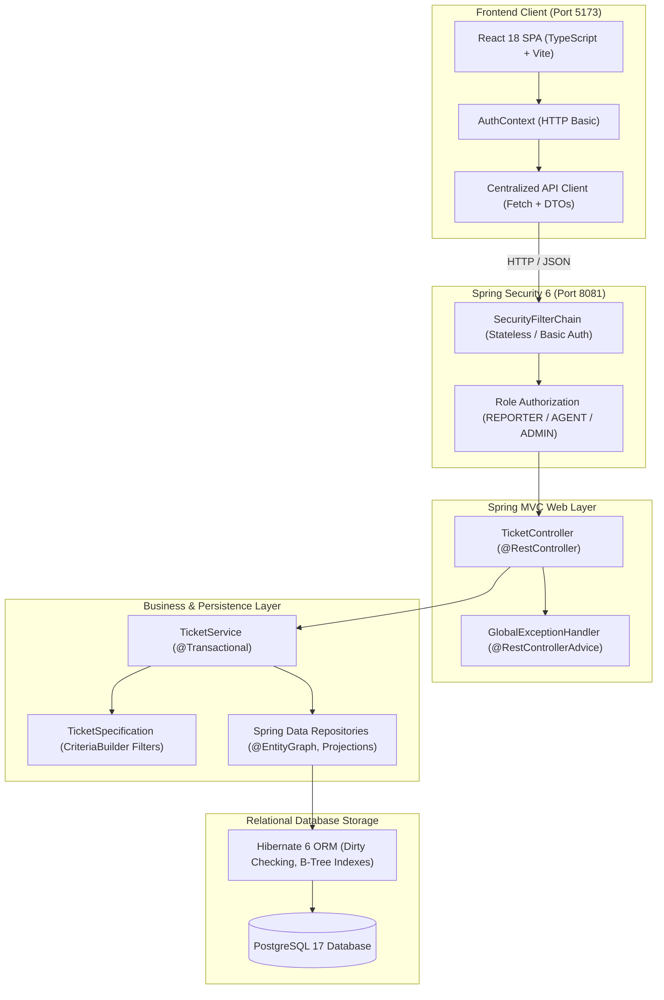

# ResolveHub

[](https://www.oracle.com/java/)
[](https://spring.io/projects/spring-boot)
[](https://spring.io/projects/spring-security)
[](https://react.dev/)
[](https://www.typescriptlang.org/)
[](https://vitejs.dev/)
[](https://www.docker.com/)
[](https://www.postgresql.org/)
[](http://localhost:8081/swagger-ui.html)
[](src/test/java)

ResolveHub is an enterprise issue-tracking and ticket resolution platform built with **Java 21, Spring Boot 3, Spring Security 6, Spring Data JPA, Hibernate 6, PostgreSQL 17, Docker Compose, and React 18**.

The system enforces deterministic ticket state transitions, Role-Based Access Control (`REPORTER`, `AGENT`, `ADMIN`), dynamic multi-criteria search with JPA Specifications, server-side pagination, N+1 query optimization via `@EntityGraph`, and immutable audit activity logging.

---

## Overview

In engineering and operations teams, ticket management systems must ensure strict data integrity, auditability, and access control. ResolveHub demonstrates a production-grade backend architecture where:
- Access permissions are enforced at the HTTP and method level.
- Multi-step business workflows execute inside atomic transaction boundaries.
- Relational data is fetched efficiently without Cartesian explosions or N+1 query bottlenecks.
- Dynamic search queries are generated cleanly at runtime without combinatorial repository method sprawl.

---

## Key Features

- **Role-Based Access Control (RBAC)**: Enforces `REPORTER`, `AGENT`, and `ADMIN` permissions using Spring Security 6, HTTP Basic authentication, and salted BCrypt password hashing.
- **Deterministic State Machine**: Enforces valid ticket status transitions (`OPEN` $\rightarrow$ `IN_PROGRESS` $\rightarrow$ `RESOLVED` $\rightarrow$ `CLOSED`) and rejects illegal regressions.
- **Dynamic Search Engine**: Composable JPA Specifications supporting keyword search, status, priority, project, assignee, and date boundaries in a single query.
- **Safe Server-Side Pagination & Sorting**: Database-level `LIMIT`/`OFFSET` queries with sort field whitelisting (`createdAt`, `updatedAt`, `priority`, `status`, `title`, `id`).
- **N+1 Query Optimization**: Strategic use of JPA `@EntityGraph` and `JOIN FETCH` to load related entity graphs in single SQL queries.
- **Append-Only Audit History**: Tracks ticket creation, assignment changes, priority changes, and status transitions for complete traceability.
- **Paginated Discussion Threads**: Ticket commenting subsystem with author metadata and eager fetch optimization.
- **Centralized REST Error Handling**: Uniform `ApiErrorResponse` JSON contracts for validation errors, 401 unauthenticated, 403 forbidden, and 404 not found states.
- **Multi-Stage Dockerization**: Multi-stage `Dockerfile` with Eclipse Temurin Java 21 non-root runtime, PostgreSQL 17 service, health checks (`pg_isready`), and persistent volumes.
- **React 18 SPA Frontend**: Lightweight TypeScript dashboard featuring role-aware UI controls, search toolbars, and status workflows.

---

## Architecture



### Request Flow
```text
Client (React / REST)
  ↓ HTTP Request (Authorization: Basic <base64>)
Spring Security Filter Chain (CORS -> BasicAuthenticationFilter -> AuthorizationFilter)
  ↓ Authenticated Principal
DispatcherServlet
  ↓ Request Mapping & Argument Resolvers
TicketController (@RestController)
  ↓ @Valid DTO Validation (MethodArgumentNotValidException -> GlobalExceptionHandler)
TicketService (@Service, @Transactional)
  ↓ Business Validation & State Machine Execution
Spring Data Repositories (TicketSpecification via CriteriaBuilder)
  ↓ Hibernate Session & First-Level Cache (Dirty Checking)
PostgreSQL 17 Database (B-Tree Indexes & Persistent Volume)
```

---

## Tech Stack

| Layer | Technologies |
|---|---|
| **Backend Framework** | Spring Boot 3.5.5, Spring MVC, Spring Security 6 |
| **Language & Runtime** | Java 21 (LTS), Eclipse Temurin OpenJDK |
| **Persistence & ORM** | Spring Data JPA, Hibernate 6, Jakarta Persistence 3.1 |
| **Database** | PostgreSQL 17 (Production/Compose), H2 (Test Isolation) |
| **API Documentation** | Springdoc OpenAPI 3.0, Swagger UI |
| **Containerization** | Docker, Docker Compose v2 |
| **Testing** | JUnit 5, Mockito, MockMvc, AssertJ, Spring Security Test |
| **Frontend** | React 18, TypeScript 5.6, Vite 6, Tailwind CSS 3.4 |

---

## API Overview

| Method | Endpoint | Purpose | Required Role | Request DTO | Response DTO |
|---|---|---|---|---|---|
| `GET` | `/v3/api-docs/**` | OpenAPI Specification | `PUBLIC` | None | JSON OpenAPI Schema |
| `GET` | `/swagger-ui/**` | Swagger UI Documentation | `PUBLIC` | None | HTML / JS Assets |
| `GET` | `/api/tickets` | Dynamic Search & Pagination | `REPORTER`, `AGENT`, `ADMIN` | Query Params | `Page<TicketResponse>` |
| `GET` | `/api/tickets/{id}` | Get Ticket Details | `REPORTER`, `AGENT`, `ADMIN` | Path Variable | `TicketResponse` |
| `POST` | `/api/tickets` | Create Ticket | `REPORTER`, `AGENT`, `ADMIN` | `CreateTicketRequest` | `TicketResponse` |
| `PUT` | `/api/tickets/{id}` | Update Ticket Details | `AGENT`, `ADMIN` | `UpdateTicketRequest` | `Ticket` |
| `PATCH` | `/api/tickets/{id}/assignee` | Assign Ticket to User | `AGENT`, `ADMIN` | `AssignTicketRequest` | `TicketResponse` |
| `PATCH` | `/api/tickets/{id}/status` | Update Ticket Status | `AGENT`, `ADMIN` | `UpdateTicketStatusRequest` | `TicketResponse` |
| `PATCH` | `/api/tickets/{id}/assign-and-start` | Assign & Start Working | `AGENT`, `ADMIN` | `AssignTicketRequest` | `TicketResponse` |
| `GET` | `/api/tickets/{id}/activities` | Get Audit History | `REPORTER`, `AGENT`, `ADMIN` | Path Variable | `List<TicketActivityResponse>` |
| `POST` | `/api/tickets/{id}/comments` | Add Discussion Comment | `REPORTER`, `AGENT`, `ADMIN` | `CreateCommentRequest` | `CommentResponse` |
| `GET` | `/api/tickets/{id}/comments` | Get Paginated Comments | `REPORTER`, `AGENT`, `ADMIN` | Path Variable, `page`, `size` | `Page<CommentResponse>` |
| `DELETE` | `/api/tickets/{id}` | Delete Ticket | `ADMIN` (`@PreAuthorize`) | Path Variable | `void` (HTTP 200) |

---

## Authentication & Authorization

ResolveHub implements a stateless authentication model using **HTTP Basic Authentication** and **Role-Based Access Control (RBAC)**.

### Role Permission Matrix

| Operation | `REPORTER` | `AGENT` | `ADMIN` |
|---|:---:|:---:|:---:|
| Browse & Search Tickets (`GET /api/tickets`) | Yes | Yes | Yes |
| View Ticket Details & History (`GET /api/tickets/{id}`) | Yes | Yes | Yes |
| Create Ticket (`POST /api/tickets`) | Yes | Yes | Yes |
| Post Comment (`POST /api/tickets/{id}/comments`) | Yes | Yes | Yes |
| Update Ticket Details (`PUT /api/tickets/{id}`) | No | Yes | Yes |
| Assign Ticket (`PATCH /api/tickets/{id}/assignee`) | No | Yes | Yes |
| Change Ticket Status (`PATCH /api/tickets/{id}/status`) | No | Yes | Yes |
| Delete Ticket (`DELETE /api/tickets/{id}`) | No | No | Yes |

### Password Security & Credentials
- Passwords are encrypted using **salted BCrypt** (`BCryptPasswordEncoder`) before persistence.
- The `User.password` field is annotated with `@JsonIgnore` to prevent serialization across API responses.
- Passwords are never logged.
- Seed credentials for local development are initialized only under `!test & !prod` profiles:
  - **Admin**: `admin@resolvehub.com` / `admin123`
  - **Agent**: `agent@resolvehub.com` / `agent123`
  - **Reporter**: `reporter@resolvehub.com` / `reporter123`

---

## Data Model

```text
    ┌──────────────┐ 1          * ┌──────────────┐
    │     User     │─────────────<│   Project    │ (Owner)
    └──────┬───────┘              └──────┬───────┘
           │ 1                           │ 1
           │                             │
           │ * (Reporter / Assignee)     │ * (Project Tickets)
           ▼                             ▼
    ┌────────────────────────────────────────────┐
    │                   Ticket                   │
    └──────┬─────────────────────────────┬───────┘
           │ 1                           │ 1
           │                             │
           │ *                           │ *
           ▼                             ▼
    ┌──────────────┐              ┌──────────────┐
    │ TicketComment│              │TicketActivity│
    └──────────────┘              └──────────────┘
```

- All `@ManyToOne` relationships are configured with `FetchType.LAZY` to prevent unconstrained eager joins.
- Child collections (`comments`, `activities`) use `CascadeType.ALL` on the `Ticket` root.

---

## Dynamic Filtering

Instead of maintaining combinatorial repository methods, `TicketSpecification` leverages the JPA Criteria API (`CriteriaBuilder`) to compose query predicates dynamically:

```text
GET /api/tickets?status=OPEN&priority=HIGH&search=payment&projectId=1&page=0&size=10
```

### Supported Filter Parameters
- `status`: Exact match (`OPEN`, `IN_PROGRESS`, `RESOLVED`, `CLOSED`)
- `priority`: Exact match (`LOW`, `MEDIUM`, `HIGH`, `CRITICAL`)
- `projectId`: Filter by parent project
- `assigneeId`: Filter by assigned user
- `reporterId`: Filter by ticket creator
- `search`: Case-insensitive `LIKE` matching across `title` OR `description`
- `createdAfter` / `createdBefore`: ISO-8601 date range filters

---

## Pagination & Sorting

- **Server-Side Execution**: Pagination is executed at the database level using `LIMIT` and `OFFSET` through Spring Data's `Pageable`.
- **Page Size Clamping**: Clamped to a maximum of 100 records per request to prevent heap exhaustion.
- **Sort Whitelisting**: Sort fields are strictly validated against an allowed set (`createdAt`, `updatedAt`, `priority`, `status`, `title`, `id`). Invalid sort fields throw `InvalidSortingException` (HTTP 400), preventing query syntax errors and property leakage.

---

## Database Indexing

PostgreSQL B-Tree indexes are defined directly in entity annotations to optimize common query patterns:

```java
@Table(name = "tickets", indexes = {
    @Index(name = "idx_tickets_status", columnList = "status"),
    @Index(name = "idx_tickets_priority", columnList = "priority"),
    @Index(name = "idx_tickets_project_id", columnList = "project_id"),
    @Index(name = "idx_tickets_assignee_id", columnList = "assignee_id"),
    @Index(name = "idx_tickets_reporter_id", columnList = "reporter_id"),
    @Index(name = "idx_tickets_created_at", columnList = "createdAt")
})
```

| Table | Index Name | Indexed Column | Query Pattern Supported |
|---|---|---|---|
| `tickets` | `idx_tickets_status` | `status` | Dynamic filter: `WHERE status = ?` |
| `tickets` | `idx_tickets_priority` | `priority` | Dynamic filter: `WHERE priority = ?` |
| `tickets` | `idx_tickets_project_id` | `project_id` | Foreign key joins & project filtering |
| `tickets` | `idx_tickets_assignee_id`| `assignee_id` | Foreign key joins & assignee filtering |
| `tickets` | `idx_tickets_reporter_id`| `reporter_id` | Foreign key joins & reporter filtering |
| `tickets` | `idx_tickets_created_at` | `created_at` | Sorting: `ORDER BY created_at DESC` & date range queries |
| `ticket_comments` | `idx_ticket_comments_ticket_id` | `ticket_id` | Fetching discussion comments by ticket |
| `ticket_comments` | `idx_ticket_comments_created_at`| `created_at` | Ordering comments newest-first |
| `ticket_activities`| `idx_ticket_activities_ticket_id`| `ticket_id`| Fetching audit history by ticket |
| `ticket_activities`| `idx_ticket_activities_created_at`| `created_at`| Ordering audit events chronologically |

---

## N+1 Query Prevention

When retrieving discussion comments for a ticket, accessing `comment.getAuthor().getName()` on lazy proxies would trigger 1 initial query + $N$ secondary queries for each author.

ResolveHub solves this by applying JPA `@EntityGraph` on [`TicketCommentRepository`](file:///Users/ayesha/Downloads/ResolveHub/src/main/java/com/ayesha/resolvehub/repository/TicketCommentRepository.java):

```java
@EntityGraph(attributePaths = {"author"})
Page<TicketComment> findByTicketIdOrderByCreatedAtDesc(Long ticketId, Pageable pageable);
```

Hibernate generates a single SQL query with a `LEFT OUTER JOIN users`, reducing database round-trips from $1+N$ down to **exactly 1**.

---

## Transaction Management

Service methods performing multi-step state mutations are annotated with `@Transactional`:
- **`createTicket`**: Persists the new `Ticket` entity and writes the initial `CREATED` `TicketActivity` audit record atomically.
- **`assignTicket` / `assignTicketAndStart`**: Updates the assignee, modifies the status, and logs the `ASSIGNED` audit record within a single ACID transaction.
- **`updateTicketStatus`**: Validates the state machine transition, modifies `status`, and logs `STATUS_CHANGED`.
- **Dirty Checking**: Inside transaction boundaries, modifications to managed entities synchronize with the database on commit without requiring explicit `repository.save()` calls.

---

## Audit Logging

Every structural ticket event creates an append-only [`TicketActivity`](file:///Users/ayesha/Downloads/ResolveHub/src/main/java/com/ayesha/resolvehub/entity/TicketActivity.java) record capturing:
- `action`: `CREATED`, `STATUS_CHANGED`, `ASSIGNED`, `PRIORITY_CHANGED`
- `description`: Human-readable event description
- `oldValue` $\rightarrow$ `newValue`: State delta (e.g. `OPEN` $\rightarrow$ `IN_PROGRESS`)
- `createdAt`: Immutable timestamp (`updatable = false`)

---

## Key Engineering Decisions

### 1. Why Spring Boot & Modular Monolith?
ResolveHub's domain has highly relational dependencies (Tickets $\rightarrow$ Projects $\rightarrow$ Users $\rightarrow$ Activities). A modular monolith provides ACID transactions, zero network latency between layers, and straightforward single-container deployment without the operational overhead of distributed microservices.

### 2. Why PostgreSQL?
Issue tracking requires strong relational integrity (foreign keys, cascading constraints) and ACID guarantees during status transitions and assignments. PostgreSQL provides robust B-Tree indexing, JSON support, and mature connection pooling.

### 3. Why DTOs over Direct Entity Exposure?
Returning JPA entities directly from `@RestController` causes `LazyInitializationException` outside active sessions, risks circular reference infinite loops during Jackson serialization, and leaks internal columns (such as password hashes). Strict Request/Response DTOs enforce a stable API contract.

### 4. Why JPA Specifications over Combinatorial Repositories?
Supporting 6 optional filters with standard repository query methods would require $2^6 = 64$ method signatures. JPA Specifications compose `CriteriaBuilder` predicates dynamically at runtime while remaining 100% type-safe.

### 5. Why `@EntityGraph` over Global EAGER Fetching?
Setting global `FetchType.EAGER` causes massive unconstrained table joins across all queries. `@EntityGraph` allows keeping associations `LAZY` by default while overriding the fetch plan declaratively for specific endpoints.

### 6. Why Whitelist Sorting?
Passing arbitrary client strings into `Sort.by()` risks unexpected runtime query exceptions or internal property leakage. Validating sort properties against a strict whitelist ensures predictable, indexed database queries.

### 7. Why HTTP Basic for this Implementation?
HTTP Basic provides a clean, stateless authentication model for REST APIs and local development without the complexity of token signing, refresh tokens, and key rotation. In production, this can be transitioned to OAuth2/OIDC without altering the service or repository layers.

---

## Testing

ResolveHub maintains a comprehensive automated test suite of **57 tests with a 100% pass rate**:

```bash
mvn clean test
```

| Test Layer | Test Class | Count | Scope & Purpose |
|---|---|:---:|---|
| **Security Integration** | `SecurityIntegrationTest` | 10 | HTTP Basic auth, RBAC permissions, 401/403 responses, Swagger public access |
| **Web MVC** | `TicketControllerTest` | 14 | Request routing, validation annotations, DTO serialization, error mapping |
| **Service Unit** | `TicketServiceTest` | 23 | Business logic, state transitions, assignment rules, activity logging |
| **JPA Repository** | `TicketRepositoryTest` | 9 | Derived queries, `@EntityGraph`, JPA Specifications, H2 database interaction |
| **Workflow Integration** | `TicketWorkflowIntegrationTest` | 1 | Full end-to-end multi-step ticket lifecycles |
| **Total** | | **57** | **100% Pass Rate (0 Failures, 0 Errors, 0 Skipped)** |

---

## API Documentation

ResolveHub embeds **OpenAPI 3.0** documentation powered by Springdoc:
- **Swagger UI**: [`http://localhost:8081/swagger-ui.html`](http://localhost:8081/swagger-ui.html)
- **OpenAPI Schema**: [`http://localhost:8081/v3/api-docs`](http://localhost:8081/v3/api-docs)

To test secured endpoints through Swagger UI, click the **Authorize** button and authenticate using HTTP Basic credentials.

---

## Running Locally

### Prerequisites
- **Java 21 JDK**
- **Maven 3.9+**
- **PostgreSQL 17** (or run via Docker)
- **Node.js 20+ & npm** (for frontend)

### 1. Clone Repository
```bash
git clone https://github.com/ayesha19765/ResolveHub.git
cd ResolveHub
```

### 2. Configure Environment
```bash
cp .env.example .env
```

### 3. Run Backend
```bash
mvn spring-boot:run
```
The backend starts on port `8081`.

### 4. Run Frontend
```bash
cd frontend
npm install
npm run dev
```
The frontend dev server starts on [`http://localhost:5173`](http://localhost:5173).

---

## Docker

ResolveHub includes a complete Docker Compose environment orchestrating the Spring Boot application and PostgreSQL 17 database.

```bash
# Build and start all services in background
docker compose up --build -d

# Inspect container health
docker compose ps

# View application logs
docker compose logs -f app

# Stop containers while preserving persistent database volume
docker compose down

# Stop containers and wipe database volume
docker compose down -v
```

---

## Configuration

| Environment Variable | Default Value | Description |
|---|---|---|
| `DB_URL` | `jdbc:postgresql://localhost:5432/resolvehub` | PostgreSQL JDBC URL (`jdbc:postgresql://postgres:5432/resolvehub` in Compose) |
| `DB_USERNAME` | `postgres` | Database username |
| `DB_PASSWORD` | `password` | Database password |
| `HIBERNATE_DDL_AUTO` | `update` | DDL generation mode (`update` in dev, `validate` in prod) |
| `SHOW_SQL` | `false` | Log SQL queries to console |
| `SPRING_PROFILES_ACTIVE`| `dev` | Active Spring profile (`dev`, `prod`, `test`) |

---

## Design Trade-offs

- **Stateless REST vs Session Cookies**: Chose stateless Basic Auth without session cookies; explicitly disabled CSRF because ambient session cookies are not used.
- **Criteria API vs QueryDSL**: Chose Spring Data JPA Specifications (native Criteria API) to avoid third-party annotation processing dependencies while retaining full type safety.
- **Selective `@EntityGraph` vs Global Eager**: Kept all entity relationships `LAZY` to avoid accidental Cartesian joins, selectively applying `@EntityGraph` only where N+1 queries occur.

---

## Limitations

- **HTTP Basic Authentication**: Intended for local development and demonstration; a distributed production environment would typically use OAuth2 / OIDC.
- **In-Memory Rate Limiting**: No distributed rate limiting or API throttling.
- **Single-Node Execution**: Not configured for horizontal clustering across multiple JVM nodes.

---

## Future Improvements

- OAuth2 / JWT integration with asymmetric key rotation.
- Asynchronous event publishing with Spring Application Events for audit history.
- Redis caching for frequently queried ticket summary dashboards.
- MinIO / S3 object storage for issue attachments and screenshots.

---

## License

This project is licensed under the MIT License.

---

**ResolveHub** · Java 21 · Spring Boot 3.5.5 · Spring Security 6 · React 18 · TypeScript · PostgreSQL 17 · Docker Compose  
© 2026 Ayesha
