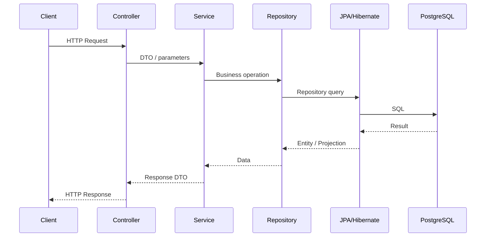
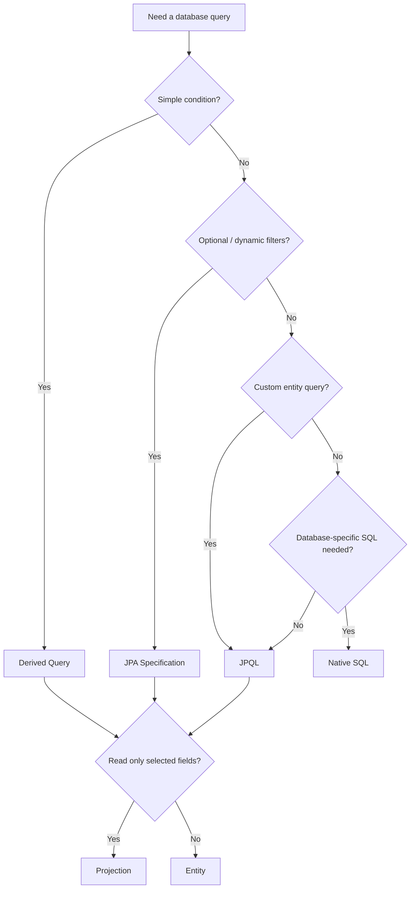

# ResolveHub Architecture

## High-Level Request Flow



## Layer Responsibilities

### Controller
Handles HTTP endpoints, request parameters, path variables, request bodies, validation entry points, and API responses.

Controllers should not contain business logic or database code.

### DTO
Separates API contracts from persistence models.

```text
Request DTO  → data entering the API
Response DTO → data intentionally exposed by the API
```

### Service
Handles business logic, entity lookup, business rules, transaction boundaries, and entity-to-DTO conversion.

### Repository
Handles database access through Spring Data JPA.

ResolveHub demonstrates:

```text
JpaRepository
Derived Queries
JPQL
Native Queries
Specifications
Projections
Pagination
```

### Entity / Hibernate
Entities represent the persistence model. Hibernate handles ORM, SQL generation, Persistence Context, dirty checking, lazy loading, and relationship loading.

### PostgreSQL
Stores persistent relational data.

## JPA Performance

### N+1 Problem

```text
findAll()
  ↓
1 query for Tickets
  ↓
Access relationship
  ↓
N additional queries
```

### Fetch Join

```text
JPQL JOIN FETCH
  ↓
Ticket + required relationship
  ↓
Fewer database round trips
```

### Projection

```text
Projection query
  ↓
Only requested fields
  ↓
Less unnecessary entity loading
```

## Query Selection



## API Design Principle

```text
Client
  ↓
Controller
  ↓
Request DTO
  ↓
Service
  ↓
Repository
  ↓
Entity / Projection
  ↓
Service
  ↓
Response DTO
  ↓
Client
```

> **Entities are persistence models. DTOs are API models.**
