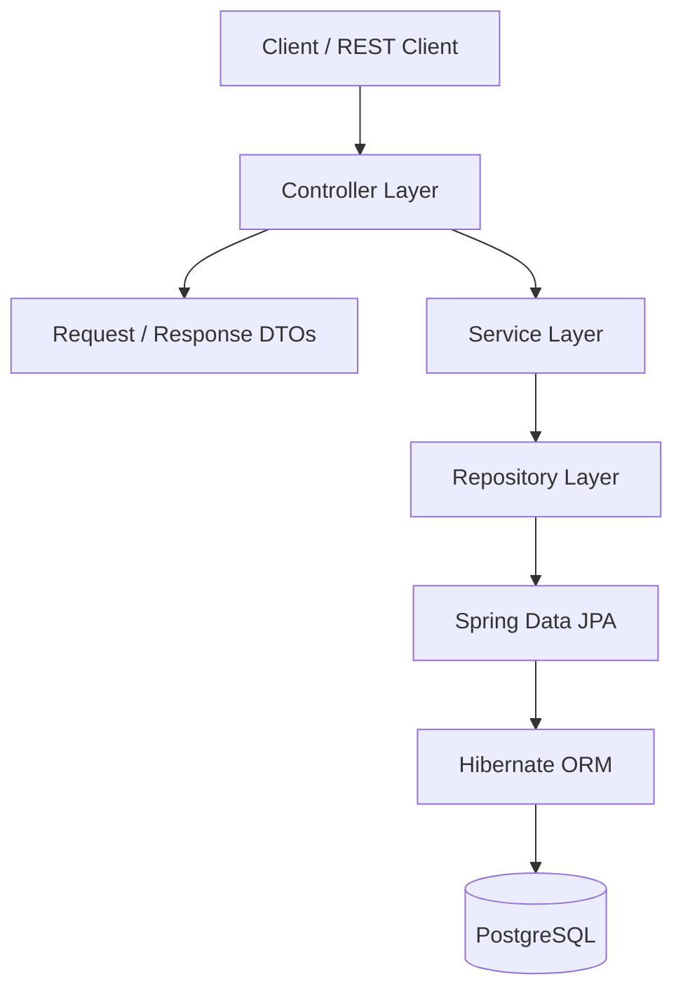
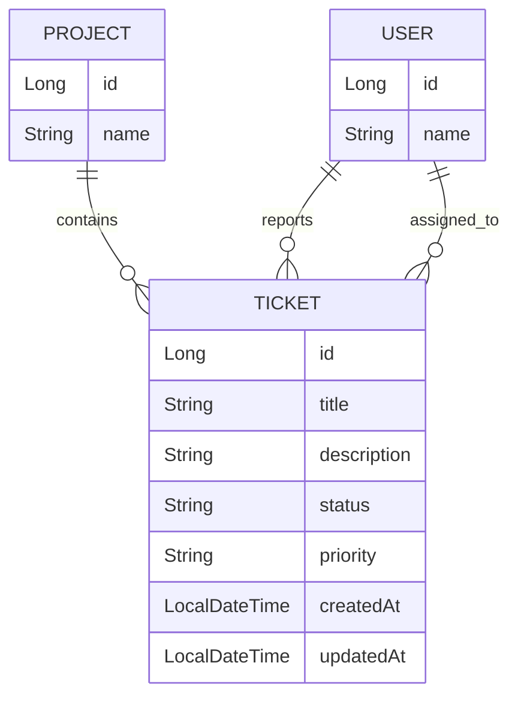

# ResolveHub

ResolveHub is a backend issue-tracking and resolution platform built with **Spring Boot, Spring MVC, Spring Data JPA, Hibernate, and PostgreSQL**.

The project is being built as a practical Spring Boot backend rather than a simple CRUD demo. It focuses on clean REST API design, relational data modeling, validation, JPA querying, pagination, projections, transaction management, and ORM performance optimization.

## Tech Stack

- Java
- Spring Boot
- Spring MVC
- Spring Data JPA
- Hibernate
- PostgreSQL
- Maven
- Lombok
- Jakarta Validation
- REST APIs

## Architecture



## Domain Model



## What Has Been Implemented

### Spring MVC and REST
- Spring Boot project setup
- Controller, service, and repository separation
- DispatcherServlet request flow
- RESTful endpoints
- GET, POST, PUT, DELETE, and PATCH concepts
- Request bodies, path variables, and query parameters

### Validation
- Request DTOs
- Jakarta Bean Validation
- `@Valid`

### JPA / Hibernate
- Entity-to-table mapping
- ORM fundamentals
- Spring Data JPA repositories
- Persistence Context
- EntityManager
- Dirty checking
- Entity relationships
- Cascading
- Lazy loading

### Querying
- Derived query methods
- JPQL
- Native SQL
- Relationship-based queries
- JPA Specifications for dynamic filtering
- Pagination
- Sorting
- Interface-based projections

### ORM Performance
- Lazy vs eager loading
- N+1 query problem
- `JOIN FETCH`
- Intentional relationship fetching
- Projections for read-heavy APIs

### API Design
- Request DTOs
- Response DTOs
- Entity-to-DTO mapping
- Filtering, pagination, and sorting through query parameters

## Example API

```http
GET /api/tickets
GET /api/tickets?status=OPEN
GET /api/tickets?priority=HIGH
GET /api/tickets?projectId=1
GET /api/tickets?search=payment
GET /api/tickets?page=0&size=10
GET /api/tickets?status=OPEN&priority=HIGH&projectId=1&search=payment&page=0&size=10
```

## Querying Strategy

| Technique | Best suited for |
|---|---|
| Derived queries | Simple conditions |
| JPQL | Custom entity-oriented queries |
| Native SQL | Database-specific or SQL-heavy queries |
| Specifications | Dynamic combinations of optional filters |
| Projections | Fetching only selected fields |
| Pagination | Large result sets |

## Performance Concepts

### N+1

```text
1 query → fetch Tickets
N queries → fetch related entities
```

### JOIN FETCH

```text
Ticket
  ↓
JOIN FETCH
  ↓
Ticket + explicitly requested relationships
```

### Projection

```text
Projection
  ↓
Only fields required by the read operation
```

## Next Development Phase

The project will now move beyond the lecture concepts and add real backend behavior:

- Transactional ticket workflows
- Assignment operations
- Activity/history records
- Comments
- Business rules
- Consistent API responses
- Automated tests
- API documentation
- Logging and production configuration
- Dockerization
- Final README and architecture polish
